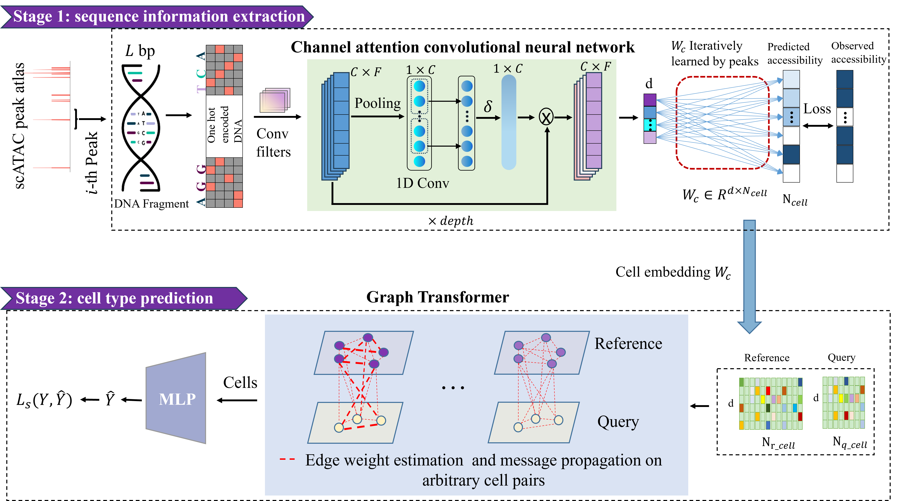

 We propose a novel method, SANGO, for accurate single cell annotation by integrating genome sequences around the accessibility peaks within scATAC data.     

# SANGO

The official implementation for "**SANGO**".

**Table of Contents**

* [Datasets](#Datasets)
* [Installation](#Installation)
* [Usage](#Usage)
* [Tutorial](#Tutorial)
* [Citation](#Citation)

## Datasets

We provide an easy access to the used datasets in the [synapse](https://www.synapse.org/#!Synapse:syn52559388/files/).

## Installation

To reproduce **SANGO**, we suggest first create a conda environment by:

~~~shell
conda create -n SANGO python=3.8
conda activate SANGO
~~~

and then run the following code to install the required package:

~~~shell
pip install -r requirements.txt
~~~

and then install [PyG](https://pytorch-geometric.readthedocs.io/en/latest/install/installation.html) according to the CUDA version, take torch-1.13.1+cu117 (Ubuntu 20.04.4 LTS) as an example:

~~~shell
pip install torch_geometric
pip install pyg_lib torch_scatter torch_sparse torch_cluster torch_spline_conv -f https://data.pyg.org/whl/torch-1.13.1+cu117.html
~~~

## Usage

### data preprocessing

In order to run **SANGO**, we need to first create anndata from the raw data.

The h5ad file should have cells as obs and peaks as var. There should be at least three columns in `var`:  `chr`, `start`, `end` that indicate the genomic region of each peak. The h5ad file should also contain two columns in the `obs`: `Batch` and `CellType`, where `Batch` is used to distinguish between reference and query data, and `CellType` indicates the true label of the cell.

Notice that we filter out peaks accessible in < 1% cells for optimal performance.

### Stage 1: embeddings extraction

The processed data are used as input to CACNN and a reference genome is provided to extract the embedding incorporating sequence information: 

~~~shell
# Stage 1: embeddings extraction
cd SANGO/CACNN

python main.py -i ../../preprocessed_data/reference_query_example.h5ad \ # input data(after data preprocessing)
               -g mm9 \ # reference genome
               -o ../../output/reference_query_example # output path
~~~

Running the above command will generate three output files in the output path:

* `CACNN_train.log`: recording logs during training
* `CACNN_best_model.pt`: storing the model weights with the best AUC score during training
* `CACNN_output.h5ad`: an anndata file storing the embedding extracted by CACNN.

### Stage 2: cell type prediction

~~~shell
# Stage 2: cell type prediction
cd ../GraphTransformer

python main.py  --data_dir ../../output/reference_query_example/CACNN_output.h5ad \ # input data
                --train_name_list reference --test_name query \
                --save_path ../../output \
                --save_name reference_query_example
~~~

Running the above command will generate three output files in the output path:

* `model.pkl`: storing the model weights with the best valid loss during training.
* `embedding.h5ad`: an anndata file storing the embedding extracted by GraphTransformer.  And `.obs['Pred']` saves the results of the prediction.
* `result.csv`: accuracy and F1 score of the prediction.

## Tutorial

### Tutorial 1: Cell annotations within samples (LargeIntestineB_LargeIntestineA)
1. Install the required environment according to [Installation](#Installation).
2. Create a folder `data` and download datasets from [LargeIntestineA_LargeIntestineB.h5ad](https://www.synapse.org/#!Synapse:syn52566797).
3. Create a folder `genome` and download [mm9.fa.h5](https://www.synapse.org/#!Synapse:syn52566798).
4. For more detailed information, run the tutorial [LargeIntestineB_LargeIntestineA.ipynb](reference_query_example.ipynb) for how to do data preprocessing and training.

### Tutorial 2: Cell annotations on datasets cross platforms (MosP1_Cerebellum)
1. Install the required environment according to [Installation](#Installation).
2. Create a folder `data` and download datasets from [MosP1_Cerebellum.h5ad](https://www.synapse.org/#!Synapse:syn52566797).
3. Create a folder `genome` and download [mm10.fa.h5](https://www.synapse.org/#!Synapse:syn52566798).
4. For more detailed information, run the tutorial [MosP1_Cerebellum.ipynb](MosP1_Cerebellum.ipynb) for how to do data preprocessing and training.

### Tutorial 3: Cell annotations on datasets cross tissues (BoneMarrowB_Liver)
1. Install the required environment according to [Installation](#Installation).
2. Create a folder `data` and download datasets from [BoneMarrowB_Liver.h5ad](https://www.synapse.org/#!Synapse:syn52566797).
3. Create a folder `genome` and download [mm9.fa.h5](https://www.synapse.org/#!Synapse:syn52566798).
4. For more detailed information, run the tutorial [BoneMarrowB_Liver.ipynb](BoneMarrowB_Liver.ipynb) for how to do data preprocessing and training.

### Tutorial 4: Multi-level cell type annotation and unknown cell type identification
1. Install the required environment according to [Installation](#Installation).
2. Create a folder `data` and download datasets from [BCC_TIL_atlas.h5ad, BCC_samples.zip, HHLA_atlas.h5ad](https://www.synapse.org/#!Synapse:syn52566797).
3. Create a folder `genome` and download [GRCh38.primary_assembly.genome.fa.h5](https://www.synapse.org/#!Synapse:syn52566798).
4. For more detailed information, run the tutorial [tumor_example.ipynb](tumor_example.ipynb) for how to do data preprocessing and training.

## Citation

If you find our codes useful, please consider citing our work:

~~~bibtex

@article{zengSANGO,
  title={Deciphering Cell Types by Integrating scATAC-seq Data with Genome Sequences},
  author={Yuansong Zeng, Mai Luo, Ningyuan Shangguan, Peiyu Shi, Junxi Feng, Jin Xu, Weijiang Yu, and Yuedong Yang},
  journal={},
  year={2023},
}
~~~